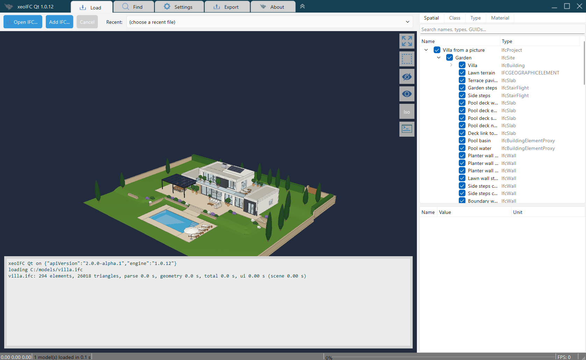

<!-- Generated file: edit the source in the dev repository. sha256:3c9427fc09c9108a -->
# xeoIFC

Public repository of xeoIFC, the xeoFoundry IFC toolkit.

xeoIFC is one Rust engine for reading, querying, tessellating, converting and writing IFC (`.ifc`, `.ifczip`; IFC 2x3 to IFC 4.3).
It is delivered in four forms, each described in its own section below:

1. **WebAssembly library** - wasm modules with a JavaScript/TypeScript API, for web applications; runs entirely in the browser.
2. **Loader for xeokit** - loads IFC directly into a xeokit viewer, without a conversion step.
3. **Command-line converter** - Windows AMD64, Linux ARM64, Linux AMD64; IFC to glTF/GLB with xeokit metadata, the successor to
   cxconverter.
4. **Native library** - `xeoifc.dll` / `libxeoifc.so` with a C ABI, for desktop and server applications in C++, C#, Python, Java, ...

The two libraries are the same engine with the same function groups, one for the browser and one for native programs; each
comes with an open-source demo viewer (xeoIFC Web, xeoIFC Qt). All four forms run on this engine, and the libraries and the
command-line tool share one document API (JSON ops in, JSON results out) for query, edit, split and merge; see
[Architecture](#architecture). The same API creates IFC models from scratch; see [Authoring](#authoring).

## 1. WebAssembly library

The WebAssembly library is the xeoIFC engine for web applications: wasm modules with JavaScript bindings and TypeScript
declarations. IFC files are processed in the browser; nothing is uploaded. A Web Worker calls its engine functions: load (the
file streamed in chunks, then tessellated), query (model tree, properties, georeference), the document API (the same JSON ops as
the native library and the command-line tool), the IFC export (split and merge) and the licence key. On the page, its WebGPU
`Viewer` class draws the models into a canvas, with camera, picking, selection, visibility and clip planes. Other formats (JT,
STEP, point clouds and meshes) are format modules that load on first use.

Function groups and a TypeScript example:
[architecture/integration-map.md](architecture/integration-map.md#webassembly-library-viewer_wasm-typescript-javascript)

Try xeoIFC Web, the demo viewer on the library:
https://xeofoundry.github.io/xeoIFC/

Drag&Drop `.ifc` or `.ifczip` files from your machine to render them locally in the browser (no upload of any IFC data).

<a href="https://xeofoundry.github.io/xeoIFC/showcase/">
  
</a>

Click the image for the [live version of this view](https://xeofoundry.github.io/xeoIFC/showcase/): the showcase page of
xeoIFC Web, with the running viewer in place of the screenshot and this model (Viadotto Acerno, IFC 4.3) loaded. Or open the
model in the [full viewer](https://xeofoundry.github.io/xeoIFC/?load=Viadotto-Acerno.ifczip).

xeoIFC Web is an open-source (MIT) browser IFC viewer: about 16,600 lines of TypeScript on the xeoIFC WebAssembly library. The
[showcase page](https://xeofoundry.github.io/xeoIFC/showcase/) shows the calls it makes. Download  `xeoifc-web-source.zip` (source code with the prebuilt library): [https://github.com/xeofoundry/xeoIFC/releases/](https://github.com/xeofoundry/xeoIFC/releases/)
(a Vite project: `npm install`, `npm run dev`; no Rust needed).

<br/>

xeoIFC Web supports
- Loading of any number of files into one scene.
- Selecting elements in the tree view or 3D view, show element properties and property sets/quantities.
- Search for GUIDs, names, types etc.
- Load terrain from public GIS databases around georeferenced IFC models.
- Export of selected elements to a new IFC file (split).
- Export of several loaded files to a new IFC file (merge).
- BCF, Minimap, storey shift, clip planes, measuring tool, compare revisions tool.
- File types: .ifc,.ifczip,.jt,.stp,.step,.glb,.bcf,.bcfzip,.las,.laz

## 2. Loader for xeokit (XeoIFCLoaderPlugin)

The WebAssembly library also feeds a [xeokit](https://github.com/xeokit/xeokit-sdk) viewer directly, without a conversion step:
the plugin runs xeoIFC in a Web Worker, unpacks its geometry buffer into a xeokit `SceneModel`, builds the `MetaModel` from the
object tree and queries property sets from the loaded model. It loads `.ifc` and `.ifczip` files (no upload of
any data).

Documentation and live examples:
https://xeofoundry.github.io/xeoIFC/xeokit-direct-ifc-loading/

The examples: a xeokit viewer that loads dropped files, and metadata from IFC for geometry from XKT.

## 3. Command-line converter

The native converter turns `.ifc` and `.ifczip` files into glTF 2.0 (`.glb`, `.gltf`), xeokit `.xkt` or a self-contained `.html` viewer, plus
xeokit-style metadata JSON. It keeps the cxconverter command-line flags and `cxconverter.json` configuration shape.

```powershell
.\xeoifc.exe -i Duplex.ifc -o test\duplex.glb
```

Features, options, output files and license key: [converter/README.md](converter/README.md) -
[configuration file](converter/configuration.md) - [metadata JSON format](converter/metadata-format.md)

## 4. Native library

`xeoifc.dll` (`libxeoifc.so`, `libxeoifc.dylib`) exposes the whole engine through one plain C header, `xeoifc.h`. Any program that
can call C loads it: C++, C# (P/Invoke), Python (ctypes), Delphi, Java (JNA); desktop GUI applications and headless server processes
alike. A host can use any subset of its function groups: the document API session, the IFC export (split and merge), background
load jobs with progress callbacks, and the wgpu renderer drawing into a native window handle.

Function groups and a C example:
[architecture/integration-map.md](architecture/integration-map.md#native-library-xeoifcdll-c-abi-any-language)

<a href="https://xeofoundry.github.io/xeoIFC/showcase/xeoifc-qt/">
  
</a>

xeoIFC Qt is an open-source (MIT) desktop IFC viewer for Windows and Linux: about 4,500 lines of C++ with Qt 6 Widgets on
`xeoifc.dll`. Click the image for the [showcase page](https://xeofoundry.github.io/xeoIFC/showcase/xeoifc-qt/) with the calls it
makes and measured load times, or download the `xeoifc-qt-source.zip` package with Visual Studio solution and CMake:
[https://github.com/xeofoundry/xeoIFC/releases/](https://github.com/xeofoundry/xeoIFC/releases/)


## Authoring

xeoIFC does not only read IFC, it writes it: the document API creates projects, storeys, elements with geometry, openings,
materials, colours and property sets, and the command-line tool runs such scripts. Generating an IFC file is easy enough to be
done with a prompt. This one was given to Claude Code (model Fable 5.1) with the `xeoifc` command-line tool at hand:

> "myVilla.png" take the picture of this villa and create an IFC model, including terrain around, high details, including
> furniture etc. Use xeoIFC API

<a href="https://xeofoundry.github.io/xeoIFC/showcase/villa/">
  
</a>

Three short follow-ups refined the result: a hallway at the top of the stairs, a staircase window, more detail in kitchen and
bathroom.

Click the image for the [live model](https://xeofoundry.github.io/xeoIFC/showcase/villa/) with the picture it was made from and
an explanation of the script. Claude read the API with `xeoifc describe`, wrote [villa.js](docs/showcase/villa/villa.js) (about 440
lines) and ran it; the result is [villa.ifc](docs/showcase/villa/villa.ifc): IFC4, 312 products, validated without findings,
generated in less than a second.

```powershell
.\xeoifc.exe run villa.js --root .
```

```js
const doc = await xeo.document.create({ schema: 'IFC4', units: { length: 'm' },
  scaffold: { site: 'Garden', building: 'Villa', storeys: [{ name: 'Ground floor', elevation: 0 }] } });
const wall = await xeo.element.add({ type: 'IfcWall', name: 'North wall', container: doc.storeys[0],
  geometry: { kind: 'wall', start: [21, 8.85], end: [0, 8.85], height: 2.9, thickness: 0.3 }, color: [0.96, 0.95, 0.92] });
await xeo.opening.add({ host: wall.ref, offset: 2, width: 1.8, height: 1.3, sill: 1.0, fill: { type: 'IfcWindow' } });
await xeo.document.save({ path: 'villa.ifc' });
```

Every call is checked against the IFC schema and answers mistakes with a hint (for example the allowed values of an
enumeration), which is what makes the API usable by people and by AI assistants alike. `xeoifc describe` prints the whole API as
TypeScript declarations.

## Architecture

The same Rust crates build the WebAssembly library, the command-line converter and the native library. Browser applications
(xeoIFC Web, the xeokit loader) load the WebAssembly library, desktop and server applications (C++, C#, Python, Java, ...) the
native library; each host goes through one document API (JSON ops in, JSON results out) and the shared geometry engine.

<picture>
  <source media="(prefers-color-scheme: dark)" srcset="architecture/integration-map-dark.svg">
  
</picture>

Full integration map with the viewer load path, per-host code samples and a comparison table:
[architecture/integration-map.md](architecture/integration-map.md)

## Third-party software

The xeoIFC libraries and the converter include open-source components (Rust crates under MIT, Apache-2.0,
ISC, Zlib and similar permissive licences, among them `laz` for LAZ point clouds, `wgpu`, `i_overlay`,
`earcutr` and `delaunator`), plus code derived from jcadlib and csg.js. The full list with all licence
texts ships as `THIRD-PARTY-NOTICES.txt` in every release package and with xeoIFC Web:
[THIRD-PARTY-NOTICES.txt](https://xeofoundry.github.io/xeoIFC/THIRD-PARTY-NOTICES.txt)
