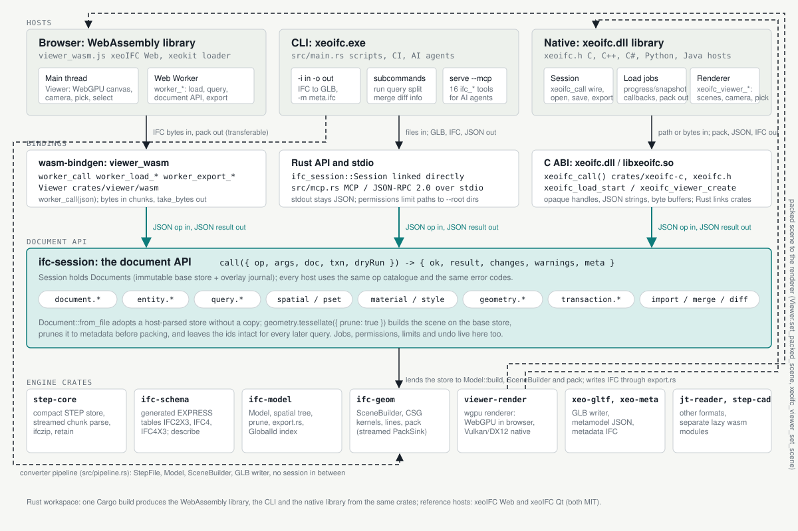

# xeoIFC

Public repository of xeoIFC, the xeoFoundry IFC toolkit.

xeoIFC is one Rust engine for reading, querying, tessellating, converting and writing IFC (`.ifc`, `.ifczip`; IFC 2x3 to IFC 4.3),
delivered as:

- a [WebAssembly viewer](#demo-for-webassembly-wasm-browser-version) that runs entirely in the browser,
- a [loader for xeokit](#demo-for-direct-ifc-loading-in-xeokit) that loads IFC directly, without a conversion step,
- a [command-line converter](converter/README.md) (Windows AMD64, Linux ARM64, Linux AMD64) to glTF/GLB with xeokit metadata, the
  successor to cxconverter,
- a [native library](architecture/integration-map.md#native-library-xeoifcdll-c-abi-any-language) (`xeoifc.dll` / `libxeoifc.so`, C ABI)
  for desktop and server applications in C++, C#, Python, Java, ...

All hosts share one document API (JSON ops in, JSON results out) for query, edit, split and merge.

## Demo for WebAssembly (WASM) browser version

Try the browser demo:
https://xeofoundry.github.io/xeoIFC/

The demo runs locally in the browser. Drag&Drop `.ifc` or `.ifczip` files from your machine to render them locally in the browser (no upload of any IFC data).

The WASM viewer supports
- Loading of any number of files into one scene.
- Selecting elements in the tree view or 3D view, show element properties and property sets/quantities.
- Search for GUIDs, names, types etc.
- Load terrain from public GIS databases around georeferenced IFC models.
- Export of selected elements to a new IFC file (split).
- Export of several loaded files to a new IFC file (merge).

## Demo for direct IFC loading in xeokit

The same WebAssembly module can feed a [xeokit](https://github.com/xeokit/xeokit-sdk) viewer directly, without a conversion step:
https://xeofoundry.github.io/xeoIFC/xeokit-direct-ifc-loading/

The page runs xeoIFC in a Web Worker, unpacks its geometry buffer into a xeokit `SceneModel`, builds the `MetaModel` from the object
tree and queries property sets from the loaded model. Drag&Drop `.ifc`, `.ifczip`, `.stp` or `.step` files (no upload of any data).

## Architecture

The same Rust crates serve the browser viewer, the command-line converter and any desktop or server application (C++, C#,
Python, Java, ...) that loads the xeoIFC native library; each host goes through one document API (JSON ops in, JSON results
out) and the shared geometry engine.

<picture>
  <source media="(prefers-color-scheme: dark)" srcset="architecture/integration-map-dark.svg">
  
</picture>

Full integration map with the viewer load path, per-host code samples and a comparison table:
[architecture/integration-map.md](architecture/integration-map.md)

## Command-line converter

The native converter turns `.ifc` and `.ifczip` files into glTF 2.0 (`.glb`, `.gltf`), xeokit `.xkt` or a self-contained `.html` viewer, plus
xeokit-style metadata JSON. It keeps the cxconverter command-line flags and `cxconverter.json` configuration shape.

```powershell
.\xeoifc.exe -i Duplex.ifc -o test\duplex.glb
```

Features, options, output files and license key: [converter/README.md](converter/README.md) -
[configuration file](converter/configuration.md) - [metadata JSON format](converter/metadata-format.md)

## Third-party software

xeoIFC and the WebAssembly viewer include open-source components (Rust crates under MIT, Apache-2.0,
ISC, Zlib and similar permissive licences, among them `laz` for LAZ point clouds, `wgpu`, `i_overlay`,
`earcutr` and `delaunator`), plus code derived from jcadlib and csg.js. The full list with all licence
texts ships as `THIRD-PARTY-NOTICES.txt` in every release package and with the viewer:
[THIRD-PARTY-NOTICES.txt](https://xeofoundry.github.io/xeoIFC/THIRD-PARTY-NOTICES.txt)
