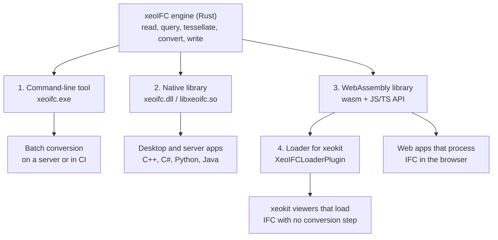
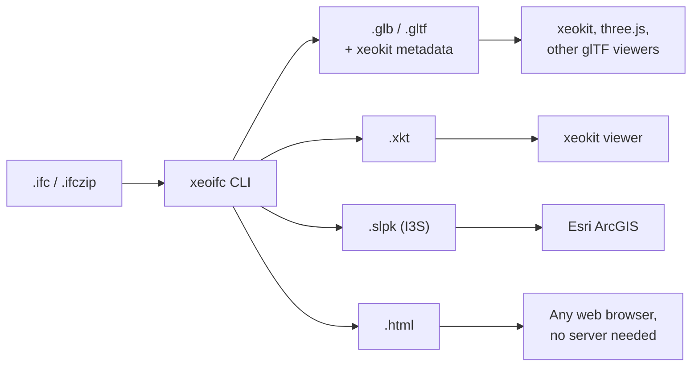
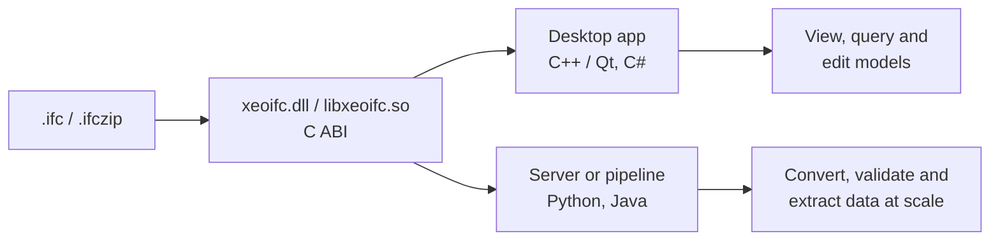
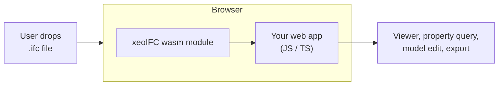
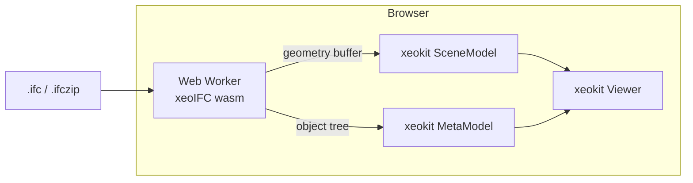

<!-- Generated file: edit the source in the dev repository. sha256:7f0d0c211077def2 -->

# xeoIFC - the xeoFoundry IFC toolkit.

> [!TIP]
> Quick start: open the [live demo](https://xeofoundry.github.io/xeoIFC/) to try xeoIFC in your browser (powered by WebAssembly).


###   
**xeoIFC is a Rust engine for reading, querying, tessellating, converting and writing IFC (`.ifc`, `.ifczip`; IFC 2x3 to IFC 4.3).**
It is delivered in four forms:

1. **Command-line tool** - The successor to [cxconverter](https://github.com/Creoox/creoox-ifc2gltfcxconverter), offering better geometry quality and far more capabilities. It covers the standard IFC to glTF/GLB/XKT workflow with [xeokit](https://github.com/xeokit/xeokit-sdk) metadata, and also supports SLPK (I3S) for Esri ArcGIS and raw IFC metadata.
2. **Native library** - `xeoifc.dll` / `libxeoifc.so` with a C ABI, for desktop and server applications in C++, C#, Python, Java, ...
3. **WebAssembly library** - wasm modules with a JavaScript/TypeScript API, for web applications.
4. **Loader for xeokit** - loads IFC directly into a xeokit viewer, without server side conversion steps.


```mermaid
flowchart TD
    E["xeoIFC engine (Rust)<br/>read, query, tessellate, convert, write"]
    E --> CLI["1. Command-line tool<br/>xeoifc.exe"]
    E --> NAT["2. Native library<br/>xeoifc.dll / libxeoifc.so"]
    E --> WASM["3. WebAssembly library<br/>wasm + JS/TS API"]
    WASM --> XL["4. Loader for xeokit<br/>XeoIFCLoaderPlugin"]
    CLI --> U1["Batch conversion<br/>on a server or in CI"]
    NAT --> U2["Desktop and server apps<br/>C++, C#, Python, Java"]
    WASM --> U3["Web apps that process<br/>IFC in the browser"]
    XL --> U4["xeokit viewers that load<br/>IFC with no conversion step"]
```

Example use cases: [xeoIFC showcase](https://xeofoundry.github.io/xeoIFC/showcase/).

## 1. Command-line converter

The native converter turns `.ifc` and `.ifczip` files into glTF 2.0 (`.glb`, `.gltf`) with xeokit metadata, xeokit `.xkt`, Esri `.slpk` (I3S) or a self-contained `.html` viewer. It keeps the cxconverter command-line flags and `cxconverter.json` configuration shape.

```powershell
.\xeoifc.exe -i Duplex.ifc -o test\duplex.glb
```


```mermaid
flowchart LR
    IFC[".ifc / .ifczip"] --> CLI["xeoifc CLI"]
    CLI --> GLB[".glb / .gltf<br/>+ xeokit metadata"] --> V1["xeokit, three.js,<br/>other glTF viewers"]
    CLI --> XKT[".xkt"] --> V2["xeokit viewer"]
    CLI --> SLPK[".slpk (I3S)"] --> V3["Esri ArcGIS"]
    CLI --> HTML[".html"] --> V4["Any web browser,<br/>no server needed"]
```

Features, options, output files and license key: [converter/README.md](converter/README.md)

## 2. Native library

`xeoifc.dll` (`libxeoifc.so` on Linux) exposes the engine through a C ABI for desktop and server applications in C++, C#,
Python, Java and other languages.


```mermaid
flowchart LR
    IFC[".ifc / .ifczip"] --> LIB["xeoifc.dll / libxeoifc.so<br/>C ABI"]
    LIB --> D["Desktop app<br/>C++ / Qt, C#"]
    LIB --> S["Server or pipeline<br/>Python, Java"]
    D --> R1["View, query and<br/>edit models"]
    S --> R2["Convert, validate and<br/>extract data at scale"]
```

Library details, examples and the Qt, gpui and WPF demo viewers: [Native library](native/README.md).

## 3. WebAssembly library

The WebAssembly library is the xeoIFC engine for web applications: wasm modules with JavaScript bindings and TypeScript
declarations. IFC files are processed in the browser; nothing is uploaded.


```mermaid
flowchart LR
    U["User drops<br/>.ifc file"] --> B
    subgraph B["Browser"]
        W["xeoIFC wasm module"] --> APP["Your web app<br/>(JS / TS)"]
    end
    APP --> R["Viewer, property query,<br/>model edit, export"]
```

Library details, demo viewer, features and downloads: [WebAssembly library](webassembly/README.md).

## 4. Loader for xeokit (XeoIFCLoaderPlugin)

The WebAssembly library also feeds a [xeokit](https://github.com/xeokit/xeokit-sdk) viewer directly, without a conversion step:
the plugin runs xeoIFC in a Web Worker, unpacks its geometry buffer into a xeokit `SceneModel`, builds the `MetaModel` from the
object tree and queries property sets from the loaded model. It loads `.ifc` and `.ifczip` files (no upload of
any data).


```mermaid
flowchart LR
    IFC[".ifc / .ifczip"] --> WK
    subgraph Browser
        WK["Web Worker<br/>xeoIFC wasm"] -- geometry buffer --> SM["xeokit SceneModel"]
        WK -- object tree --> MM["xeokit MetaModel"]
        SM --> V["xeokit Viewer"]
        MM --> V
    end
```

Documentation and live examples:
[https://xeofoundry.github.io/xeoIFC/xeokit-direct-ifc-loading/](https://xeofoundry.github.io/xeoIFC/xeokit-direct-ifc-loading/)

The examples: a xeokit viewer that loads dropped files, and metadata from IFC for geometry from XKT.

## Authoring

> [!WARNING]
> New and experimental: IFC authoring is still under active development.

The document API creates IFC models from scratch, including geometry, materials and property sets. The command-line tool
runs authoring scripts. See [Authoring](authoring/README.md) for examples, screenshots and code.

## Architecture

One Rust engine powers the WebAssembly library, the command-line converter and the native library, with a shared document
API and geometry engine. See [Architecture](architecture/integration-map.md) for details.

## Third-party software

The xeoIFC libraries and the converter include open-source components (Rust crates under MIT, Apache-2.0,
ISC, Zlib and similar permissive licences, among them `laz` for LAZ point clouds, `wgpu`, `i_overlay`,
`earcutr` and `delaunator`), plus code derived from jcadlib and csg.js. The full list with all licence
texts ships as `THIRD-PARTY-NOTICES.txt` in every release package and with xeoIFC Web:
[THIRD-PARTY-NOTICES.txt](https://xeofoundry.github.io/xeoIFC/THIRD-PARTY-NOTICES.txt)

The xeoIFC gpui packages add `THIRD-PARTY-NOTICES-gpui.txt` for the Rust crates of that application (gpui and its
dependencies, under Apache-2.0, MIT and similar permissive licences).
