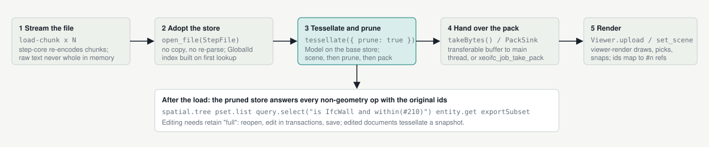

# One library, three hosts

The xeoIFC crates form one Rust stack. A browser viewer, the command-line converter and a native shared library
(`xeoifc.dll` / `libxeoifc.so`, a C ABI for any desktop or server application: C, C++, C#, Python, Java, ...) all sit on
the same document API and the same geometry engine; only the thin binding layer in the middle differs per host.

<picture>
  <source media="(prefers-color-scheme: dark)" srcset="integration-map-dark.svg">
  
</picture>

Reading the arrows: the teal arrows are the JSON wire (control only, never bulk data), the solid black arrows are Rust
calls inside one process, and the dashed paths are the direct engine paths that carry binary buffers without a session:
the packed scene going straight to a renderer, and the classic converter pipeline.

Every host talks to `ifc-session` through the same JSON op wire; the binding layer only moves strings and byte buffers
across the language boundary. Packed scenes go straight from the engine to the renderer, and the converter pipeline
still drives the engine without a session.

> **Status (September 2026).** The document API, the wasm `IfcSession`, the C ABI and the CLI subcommands exist and
> are tested. The browser viewer's worker runs on session documents: the streamed store is adopted without a copy,
> the scene is built and the store pruned through the document, and the tree, property and georeference queries read
> the document's kept engine indexes. Its IFC export runs the split-and-merge writer over session documents, so the
> output is unchanged. The C ABI exposes the same wire plus background load jobs (progress and preview callbacks),
> the native renderer and the export; `apps/xeoifc-qt`, a C++ Qt Widgets application, is its reference host and
> uses nothing but the DLL.

## Load path in a viewer host

<picture>
  <source media="(prefers-color-scheme: dark)" srcset="load-path-dark.svg">
  
</picture>

The viewer's order of operations, expressed as session calls. Steps 1 to 3 cost the same as the current worker: one
parse, one model build, one scene build, and the prune before the pack keeps the wasm heap peak where it is today.

## What each host writes

### WASM viewer (TypeScript)

The worker owns an `IfcSession`; the main thread owns the `Viewer`. Control is JSON, bulk data crosses as
transferable buffers.

```ts
import init, { IfcSession } from './pkg/viewer_wasm';
await init();
const s = new IfcSession();
const doc = s.openBytes(bytes, 'Duplex.ifc', true);
const r = JSON.parse(s.call(JSON.stringify({
  op: 'geometry.tessellate',
  args: { prune: true } })));
const packed = s.takeBytes();
post({ type: 'loaded', packed }, [packed.buffer]);
// later, from the tree panel:
s.call('{"op":"spatial.tree","args":{"depth":2}}');
```

- Built by `npm run wasm` (wasm-pack, one module per format).
- The session code adds 0.44 MB gzipped to the viewer bundle.

### CLI (shell, scripts, agents)

The legacy flags keep the converter pipeline. Subcommands and the MCP server run the document API in-process.

```text
xeoifc -i model.ifc -o model.glb -m model_meta.ifc

xeoifc query model.ifc "is IfcWall and within(#210)"
xeoifc split model.ifc --refs 2O2Fr$t4X7Zf8NOew3FLKn -o wall.ifc
xeoifc merge a.ifc b.ifc -o merged.ifc
xeoifc run script.json      # batch of ops, dryRun aware

xeoifc serve --mcp --root E:/work/ifcFiles
# MCP client: ifc_open, ifc_query, ifc_edit, ifc_save ...
```

- One executable, no runtime dependencies.
- Paths are sandboxed to the `--root` directories.

### Native library: xeoifc.dll (C ABI, any language)

`crates/xeoifc-c` builds `xeoifc.dll` (`libxeoifc.so`, `libxeoifc.dylib`) with one plain C header, `xeoifc.h`. Any
program that can call C loads it: C++, C# (P/Invoke), Python (ctypes), Delphi, Java (JNA); desktop GUI applications and
headless server processes alike. Every function is thread-compatible and never throws; strings are UTF-8 JSON owned by the
caller until the matching `xeoifc_free_*`. The header has five groups:

| Group | Functions | What crosses the boundary |
|---|---|---|
| Library | `xeoifc_version`, `xeoifc_free_string/bytes/floats/u32` | version JSON; frees for every buffer the DLL hands out |
| Session | `xeoifc_session_new/free/set_roots`, `xeoifc_call`, `xeoifc_open_bytes`, `xeoifc_save_bytes`, `xeoifc_take_bytes`, `xeoifc_take_events`, `xeoifc_last_error` | the JSON op wire, IFC bytes in and out, observe events |
| Export | `xeoifc_export` | `[{docId, selection}]` in, one merged IFC out (the split-and-merge writer) |
| Load jobs | `xeoifc_load_start`, `xeoifc_job_poll`, `xeoifc_job_take_pack/lines/edges`, `xeoifc_element_query`, `xeoifc_job_cancel/free` | a background parse + tessellate with progress and preview callbacks; packed scene, drafting lines and sharp edges as buffers; tree, properties and georeference as JSON |
| Renderer | `xeoifc_viewer_create/free/resize/frame`, `set_scene/preview/clear`, camera (`orbit`, `pan_start/to/end`, `anchor_pick`, `zoom`, `fit_*`, `camera_state`), `pick/pick_area/hover`, `set_selection/visible/transparent`, line layers, sharp edges, background, stats | wgpu drawing into a host window handle (HWND, X11 window, NSView); elements addressed as `(scene, entity)` pairs |

A host can use any subset: the session alone for a headless query or edit service, session + jobs + its own
renderer, or all five for a complete viewer.

```c
#include <xeoifc.h>

XeoIfcSession* s = xeoifc_session_new();
xeoifc_session_set_roots(s, "[\"E:/projects\"]");

/* the wire: same ops and error codes as the wasm and CLI hosts */
char* out = xeoifc_call(s,
  "{\"op\":\"query.select\",\"doc\":\"d1\","
  "\"args\":{\"where\":\"is IfcWall and within(#210)\"}}");
xeoifc_free_string(out);

/* a load job: parse + tessellate on a DLL thread, callbacks report progress */
XeoIfcJob* job = xeoifc_load_start(s, "E:/projects/a.ifc", NULL, NULL);
while (xeoifc_job_poll(s, job, NULL) == 0) { /* pump the GUI, ~30 ms */ }
uint8_t* pack; size_t n;
xeoifc_job_take_pack(job, &pack, &n);

/* the renderer: draw into a native child window, then xeoifc_viewer_frame on a ~16 ms timer */
XeoIfcViewer* v = xeoifc_viewer_create(hwnd, NULL, w, h, NULL);
xeoifc_viewer_set_scene(v, pack, n, 0, NULL);
xeoifc_free_bytes(pack, n);
xeoifc_job_free(job);
```

- `apps/xeoifc-qt` is the reference host: a C++ Qt Widgets application in which the DLL parses, tessellates and
  renders into a native child window while the Qt side owns the ribbon, tree, properties and dialogs. It uses no
  Rust and no engine crate directly, so it doubles as the compatibility test of the header.
- Rust hosts do not need the C layer: they link `ifc-session`, `ifc-geom` and `viewer-render` directly and make the
  same calls (the in-tree `crates/viewer/qt` cxx-qt viewer does).
- The DLL carries the whole engine, so a native host has no wasm 4 GiB cap and no prune requirement; `retainFull`
  keeps documents editable.

## What stays shared, what differs

| Concern | WASM viewer | CLI | Native library (xeoifc.dll) |
|---|---|---|---|
| Parse and store | step-core, streamed chunks in the worker | step-core, whole file | step-core on the job thread, or bytes via xeoifc_open_bytes |
| Document API | IfcSession (wasm-bindgen) | ifc_session::Session in-process, MCP over stdio | xeoifc_call over the C ABI, from any language |
| Geometry | ifc-geom via geometry.tessellate, pack transferred | ifc-geom via the converter pipeline (GLB) or the session (jobs) | ifc-geom in the load job; pack handed to the host or to the DLL's renderer |
| Rendering | viewer-render on WebGPU | none (files out) | viewer-render on Vulkan / DX12 / Metal into a host window handle (HWND, X11, NSView) |
| Memory model | prune after tessellation, 4 GiB wasm cap | process memory, no prune needed | process memory; retainFull or prune per document |
| Clock and randomness | installed from JS (Date.now, Math.random) | std | std |
| Security | bytes in, bytes out; no filesystem | filesystem roots, permissions | filesystem roots, permissions; bytes-only use needs no roots |

---

Powered by xeoFoundry - [www.xeofoundry.com](https://xeofoundry.com)
