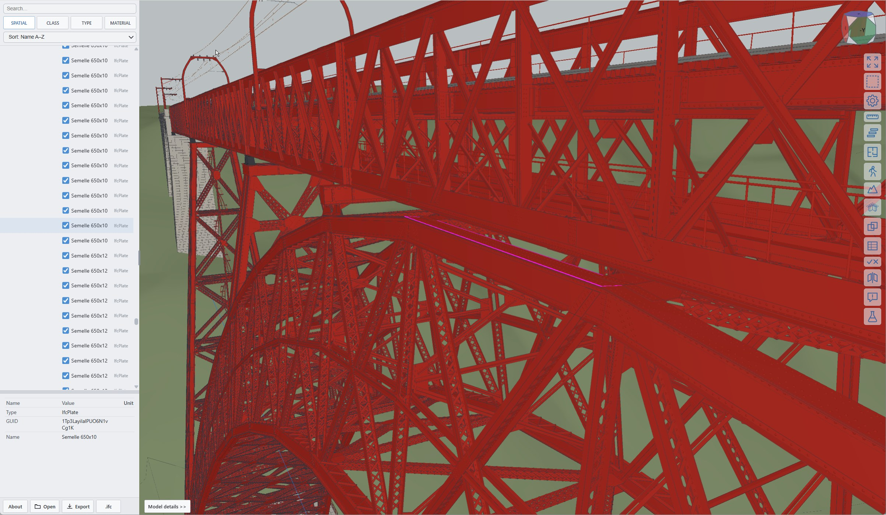
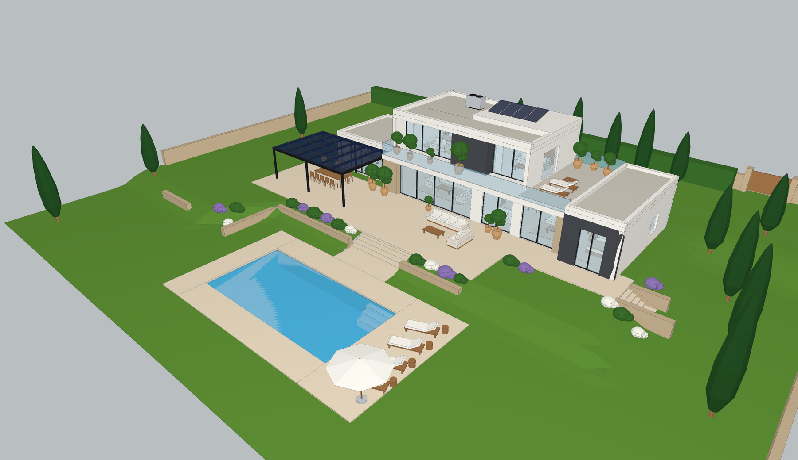

<!-- Generated file: edit the source in the dev repository. sha256:6baafde799dd1651 -->
# Authoring

[Back to xeoIFC](../README.md#authoring)

> **New and experimental:** IFC authoring is still under active development. The API and behaviour may change;
> validate generated IFC models before production use.

xeoIFC can read and render IFC files, but also write and edit them: the document API creates projects, storeys, elements with geometry, openings,
materials, colours and property sets, and the command-line tool runs such scripts.

## Garabit viaduct

The Garabit viaduct shows detailed infrastructure authoring in IFC4.3: a federated model of the railway, masonry,
steel arch, piers and deck. Individual steel plates, angles, bracing and connection components are modelled rather
than represented only as simplified beams. Historical engineering drawings and photographic references guide the reconstruction.

<a href="https://xeofoundry.github.io/xeoIFC/showcase/garabit/">
  
</a>

Open the [live model and reconstruction notes](https://xeofoundry.github.io/xeoIFC/showcase/garabit/) to inspect the
federated model and its sources. This is a reconstruction under refinement, not an as-built survey or a structural verification.

## Villa

Generating an IFC file is easy enough to be
done with a prompt. This one was given to Claude Code (model Fable 5.1) with the `xeoifc` command-line tool at hand:

> "myVilla.png" take the picture of this villa and create an IFC model, including terrain around, high details, including
> furniture etc. Use xeoIFC API

<a href="https://xeofoundry.github.io/xeoIFC/showcase/villa/">
  
</a>

Three short follow-ups refined the result: a hallway at the top of the stairs, a staircase window, more detail in kitchen and
bathroom.

Click the image for the [live model](https://xeofoundry.github.io/xeoIFC/showcase/villa/) with the picture it was made from and
an explanation of the script. Claude read the API with `xeoifc describe`, wrote [villa.js](../docs/showcase/villa/villa.js) (about 440
lines) and ran it; the result is [villa.ifc](../docs/showcase/villa/villa.ifc): IFC4, 312 products, validated without findings,
generated in less than a second.

```powershell
.\xeoifc.exe run villa.js --root .
```

```js
const doc = await xeo.document.create({ schema: 'IFC4', units: { length: 'm' },
  scaffold: { site: 'Garden', building: 'Villa', storeys: [{ name: 'Ground floor', elevation: 0 }] } });
const wall = await xeo.element.add({ type: 'IfcWall', name: 'North wall', container: doc.storeys[0],
  geometry: { kind: 'wall', start: [21, 8.85], end: [0, 8.85], height: 2.9, thickness: 0.3 }, color: [0.96, 0.95, 0.92] });
await xeo.opening.add({ host: wall.ref, offset: 2, width: 1.8, height: 1.3, sill: 1.0, fill: { type: 'IfcWindow' } });
await xeo.document.save({ path: 'villa.ifc' });
```

Every call is checked against the IFC schema and answers mistakes with a hint (for example the allowed values of an
enumeration), which is what makes the API usable by people and by AI assistants alike. `xeoifc describe` prints the whole API as
TypeScript declarations.
