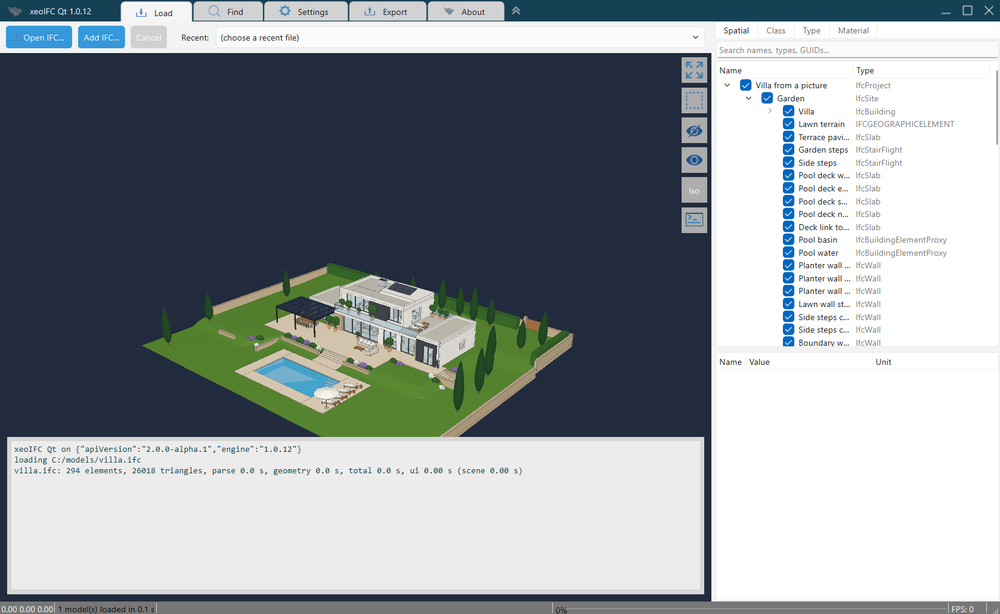
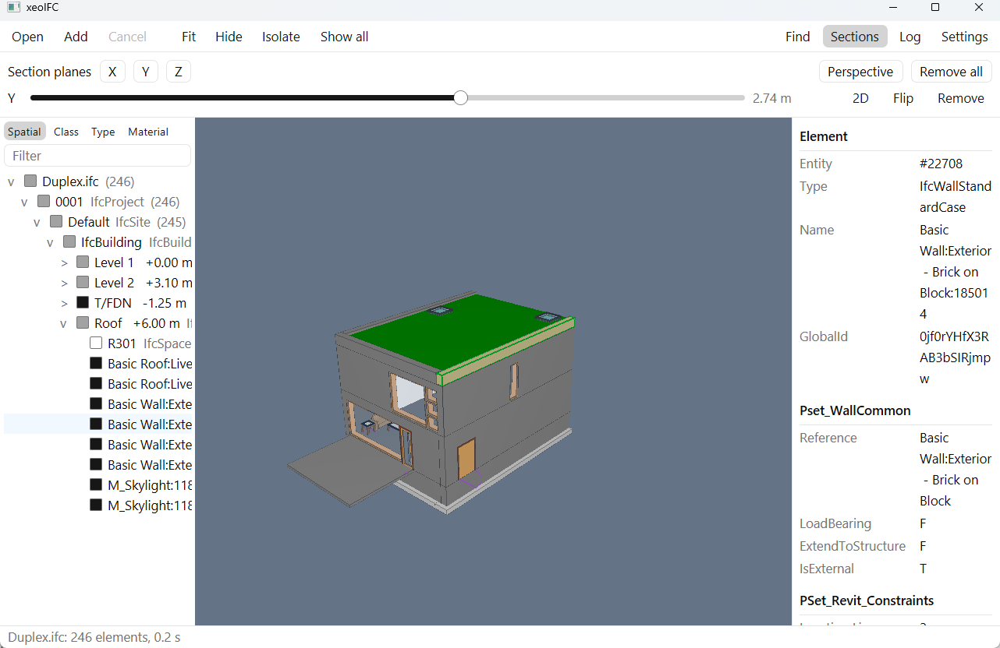

<!-- Generated file: edit the source in the dev repository. sha256:8111acd46ec25c9a -->
# Native library

[Back to xeoIFC](../README.md#4-native-library)

`xeoifc.dll` (`libxeoifc.so` on Linux) exposes the whole engine through one plain C header, `xeoifc.h`. Any program that
can call C loads it: C++, C# (P/Invoke), Python (ctypes), Delphi, Java (JNA); desktop GUI applications and headless server processes
alike. Small working programs in C, C# and Python are in [examples](../examples); the
[Build on xeoIFC](https://xeofoundry.github.io/xeoIFC/showcase/integrate/) page lists every platform and recipe. A host can use any subset of its function groups: the document API session, the IFC export (split and merge), background
load jobs with progress callbacks, and the wgpu renderer drawing into a native window handle.

Function groups and a C example:
[architecture/integration-map.md](../architecture/integration-map.md#native-library-xeoifcdll-c-abi-any-language)

xeoIFC Qt is an open-source (MIT) desktop IFC viewer for Windows and Linux: about 4,500 lines of C++ with Qt 6 Widgets on
`xeoifc.dll`. Click the image for the [showcase page](https://xeofoundry.github.io/xeoIFC/showcase/xeoifc-qt/) with the calls it
makes and measured load times, or download the `xeoifc-qt-source.zip` package with Visual Studio solution and CMake:
[https://github.com/xeofoundry/xeoIFC/releases/](https://github.com/xeofoundry/xeoIFC/releases/)

xeoIFC gpui is an open-source (MIT) desktop IFC viewer for Windows without Qt: about 1,700 lines of Rust with gpui, the UI
framework of the Zed editor, on `xeoifc.dll`. Click the image for the [showcase page](https://xeofoundry.github.io/xeoIFC/showcase/xeoifc-gpui/)
that shows how a gpui window hosts the 3D view of the library, or download `xeoifc-gpui-windows-amd64.zip` (ready to run) or
`xeoifc-gpui-source.zip` (the Cargo project with the library) from the releases page.
